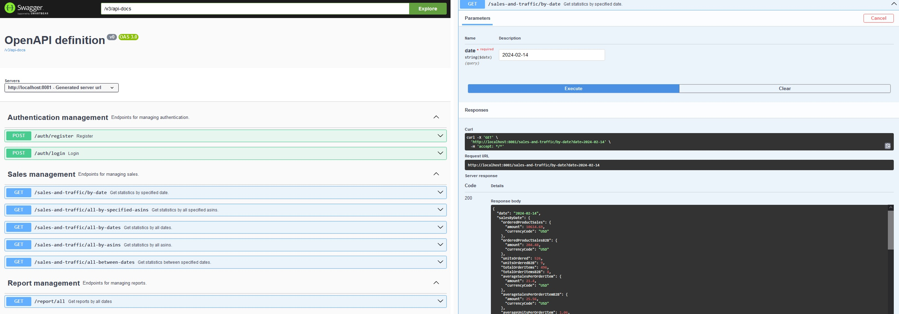

# Seller Retail Reports API

This Spring Boot project helps in managing of Amazon seller reports. It can work with a big amount of data and different fields of statistics.


## Demo

[Watch video of working API --- YouTube Link](https://www.youtube.com/embed/7ooeL1PQU1Q?si=OUybXtMFl6JrWSrU)




## Tech Stack

Technologies that used to create an efficient and well-organized environment for the development and management of the Reports API.

**Java 17**

**Spring Boot**

**Spring Security**

**Spring Cache**

**Spring Data MongoDB**

**MongoDB**

**API Documentation:** Swagger

**Build Tool:** Maven


## Run Locally

**This API requires JDK 17 and MongoDB Compass**

Clone the project

```
git clone https://github.com/fedorovychh/seller-retail-reports.git
```

Open project in IntelliJ IDEA

Load Maven dependencies

Define properties in the application.properties file to match your needs

Start the project

Open the address http://localhost:8081/swagger-ui/index.html in your browser

Success!!!
